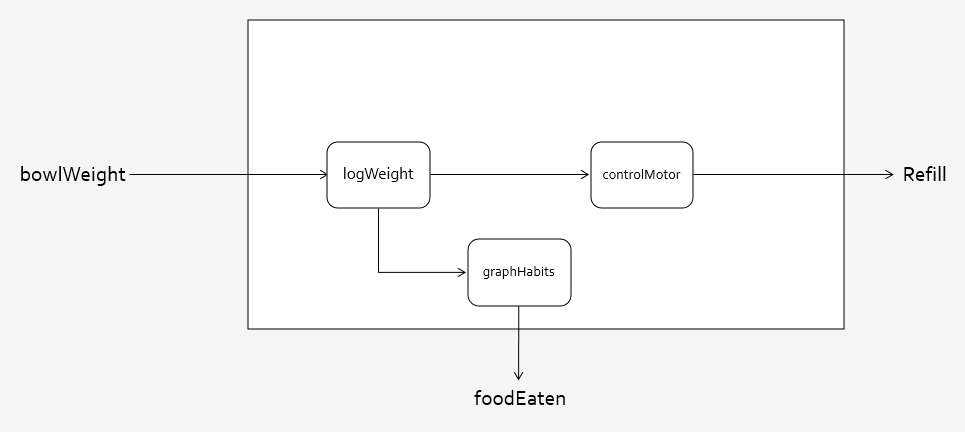

# Automated Pet Feeder IoT Project

### A pet feeder that will automatically refill itself when the bowl is empty.

Built using an Arduino and the Arduino IDE, a HX711 stress sensor and a servo motor.

